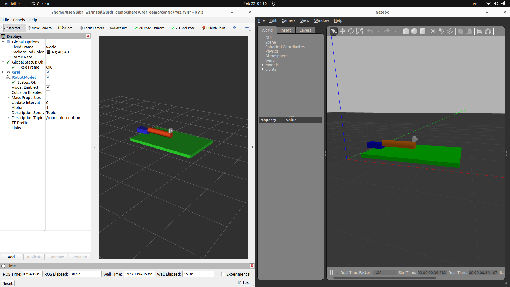

# lab3
## objective

- xacro/urdf gazebo extra tags
  - plugin
  - add damping
- Launch gazebo
- Launch rviz
- 

## to read
- [Getting Ready for ROS Part 7: Describing a robot with URDF](https://articulatedrobotics.xyz/ready-for-ros-7-urdf/)

## Quiz
- check joint_state topic
  - Which Node publish the topic
- joint `<dynamics damping="10.0" friction="10.0"/>` explain

## Result

