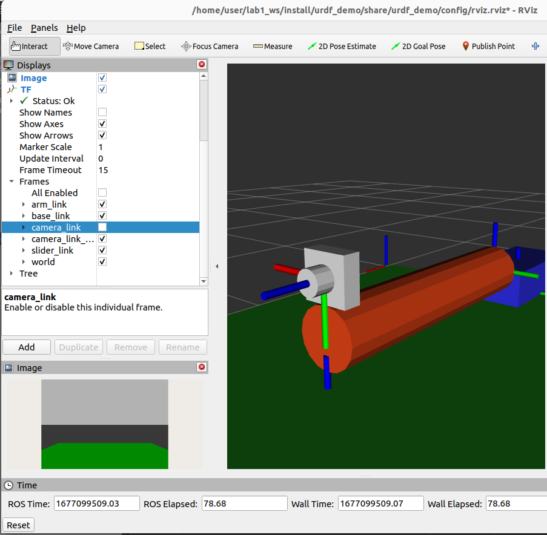
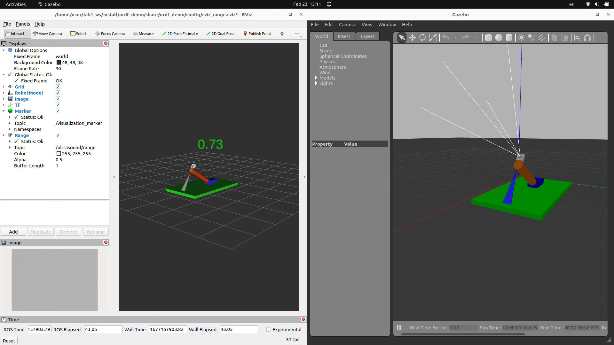
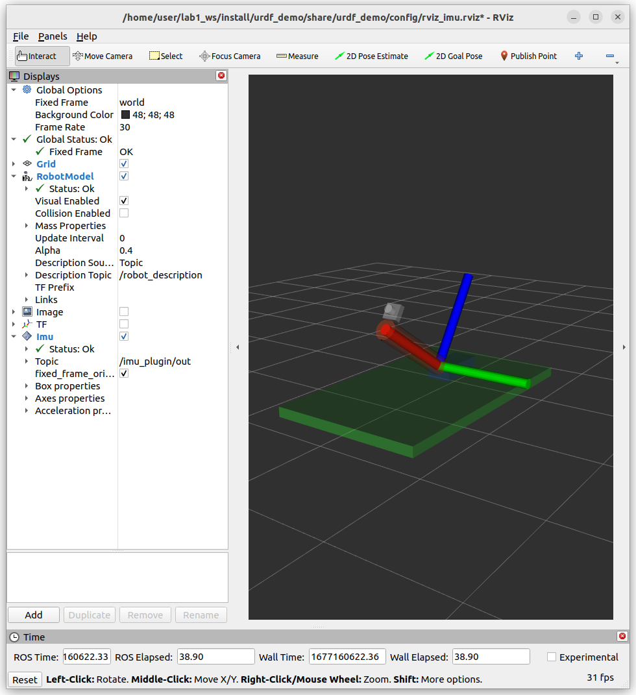

# lab4
## Objective

- Add Sensors
  - camera
  - imu
  - range
- capture camera topic using cv_bridge 
- more launch features
- rviz markers
 
## Exercise
1. Add sensors
   1. camera sensor
      1. Explain `camera_link_optical` role
   2. range sensor
      1. mount sensor opposite to the camera
   3. imu
      1. mount sensor with the range sensor
2. Write simple node viewer
3. Write simple node publish Range reading as marker
4. Write launch file with new rviz config show the Range, Marker, 
   1. run marker_node
   2. run trajectory 
5. Write launch file with new rviz config show IMU
   1. set robot_descriptor `alpha` to 0.3 to view IMU axis better
6. Run rviz after gazebo launched , using Timer or other method


## Tips
- Don't forget to add optical link frame to fix camera coordinate frame [...]()

## To read
- [imu](https://www.youtube.com/watch?v=GNjN51NvJ6s)
- [Learn about event handlers in ROS 2 launch files](https://docs.ros.org/en/foxy/Tutorials/Intermediate/Launch/Using-Event-Handlers.html#event-handlers-example-launch-file)
## Result


1. [check gazebo.xacro for sensor](src/urdf_demo/urdf/gazebo.xacro)
2. [simple viewer](src/urdf_demo/urdf_demo/simple_image_viewer.py)
3. [rviz range marker](build/urdf_demo/build/lib/urdf_demo/range_marker.py)
4. [rviz marker launch](launch/urdf_demo/../../src/urdf_demo/launch/lab4_v3.launch.py)




!!! tip send joint_trajectory 
      ```
      ros2 topic pub -1 /set_joint_trajectory trajectory_msgs/msg/JointTrajectory  '{header: {frame_id: world}, joint_names: [slider_joint, arm_joint],  points: [  {positions: {0.8,0.6}} ]}'
      ```

5. Add Imu sensor
- [launch_file](src/urdf_demo/launch/lab4_v4.launch.py)
- [urdf file](src/urdf_demo/urdf/imu.urdf.xacro)



6. [rviz with timer action ](src/urdf_demo/launch/lab4_v2.launch.py)