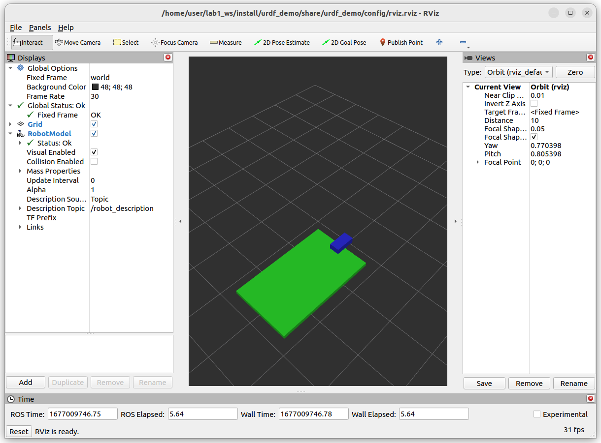

# lab0 / basic
## objective
- package setup
- write minimal urdf
- write first launch file 
  - launch rviz with robot_description

## to read
- [Getting Ready for ROS Part 7: Describing a robot with URDF](https://articulatedrobotics.xyz/ready-for-ros-7-urdf/)

## final result
