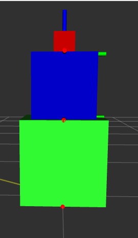
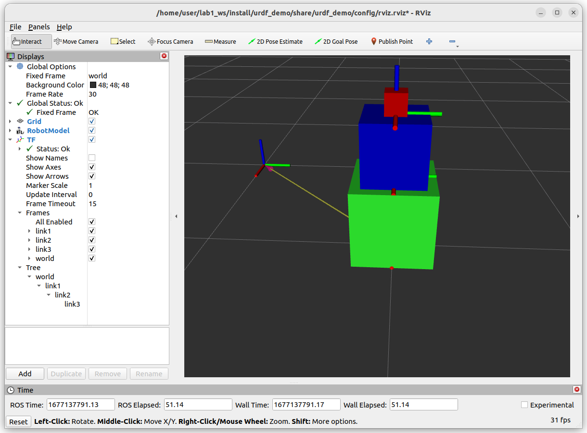
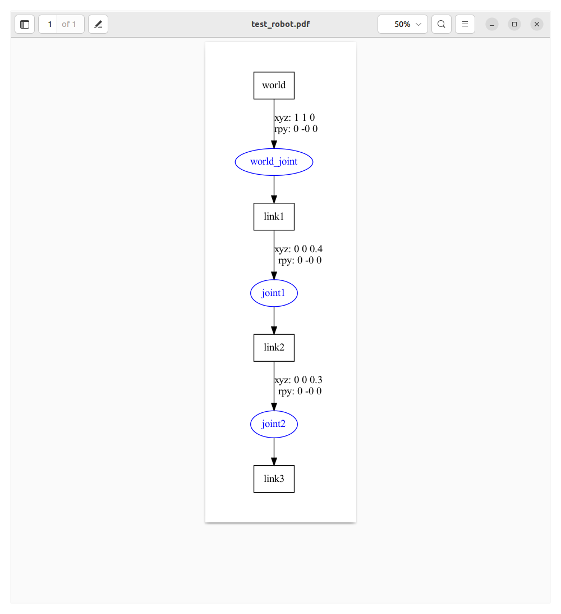
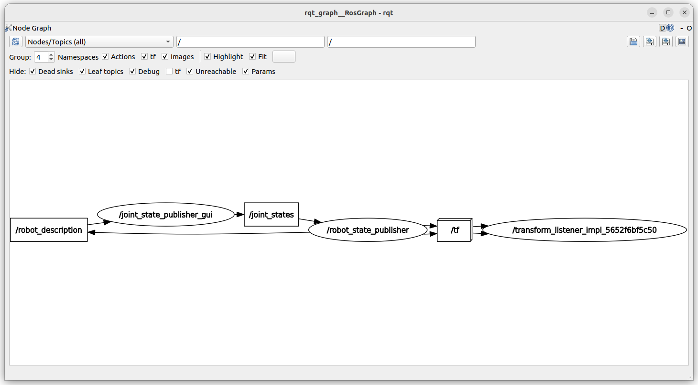

# lab1
## objective
- Understand basic urdf
  - links (visual)
  - joint 
  - origin
- Debug urdf using `urdf_to_graphviz` and `rviz`
- Build basic robot with urdf
  - Add slider link and prismatic joint
- Basic launch file to load the robot description and show it in rviz
- `joint_state_publisher_gui` usage

## to read
- [Getting Ready for ROS Part 7: Describing a robot with URDF](https://articulatedrobotics.xyz/ready-for-ros-7-urdf/)
- [urdf joint](http://wiki.ros.org/urdf/XML/joint)
## Quiz
1. Create `mini.urdf` file with 3 links and joints
   1. fixed joint between world and link 1
   2. continuous between `link1` and `link2`
   3. revolute between `link2` and `link3`
   
2. write launch file that visualize `mini.urdf` in rviz 
   1. show urdf tree using `urdf_to_graphviz` or `check_urdf`
   2. explain visual origin and joint origin
   3. explain joint `axis` tag
   4. fixed joint1 to rotate around z axis
   5. limit joint2 to half circle
   6. what is the different between `continuous` and `revolute` joints
3. Show topic and node using ros cli and graph
4. What is the topic name and msg type between `joint_state_publisher_gui` and `robot_state_publisher`
5. explain the graph


---

## Results
### Quiz 1
[urdf](src/urdf_demo/urdf/mini.urdf)


#### Quiz2
[launch file](src/urdf_demo/launch/mini.launch.py)

##### rviz with tf after launch

##### 2.1
```
urdf_to_graphviz /home/user/lab1_ws/src/urdf_demo/urdf/mini.urdf mini.pdf
```



##### 2.2
- **visual origin**: Define where the center of the visual element should be, relative to its origin. 
- **joint origin**: It's defined in terms of the parent's reference name
##### 2.3
```
<axis xyz="0 0 1" />

```
##### 2.4
```xml
<limit effort="30" velocity="1.0" lower="-0.707" upper="0.707"/>
```
#### Quiz3
```bash
ros2 topic list
```

```bash
ros2 node list
```

```bash
ros2 run rqt_graph rqt_graph
```

