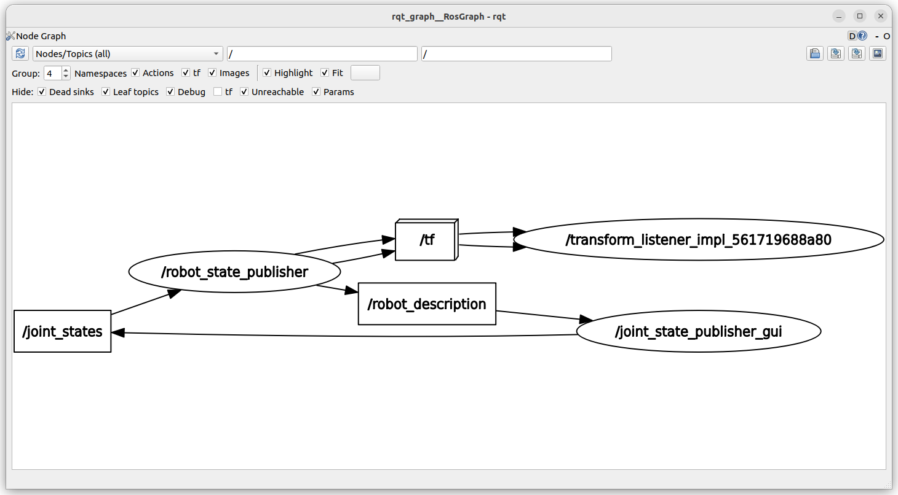

# lab1
## objective

- Build basic robot with urdf
  - Add slider link and prismatic joint
- Write basic launch file to load the robot description and show it in rviz
- Move link using robot_state_publisher_gui

## to read
- [Getting Ready for ROS Part 7: Describing a robot with URDF](https://articulatedrobotics.xyz/ready-for-ros-7-urdf/)

## Quiz
1. Show topic and node using ros graph
1. What is the topic name and msg type between `robot_state_publisher_gui` and `robot_state_publisher`
1. explain the graph



4. explain 
```
ros2 topic hz /joint_states 
average rate: 9.994
	min: 0.100s max: 0.101s std dev: 0.00026s window: 12
average rate: 9.996
	min: 0.100s max: 0.101s std dev: 0.00023s window: 22

```

5. What is the different between **rviz** `fixed Frame`
  - world
  - base_link

5a. update rviz config to work from `base_link` point of view (write new launch file)

#### bonus
1. What is the different between  /tf    /tf_static 
2. which node publish and subscribe to `/tf_static `
user@lap2: