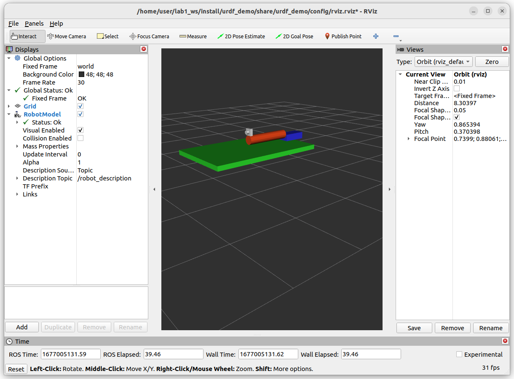
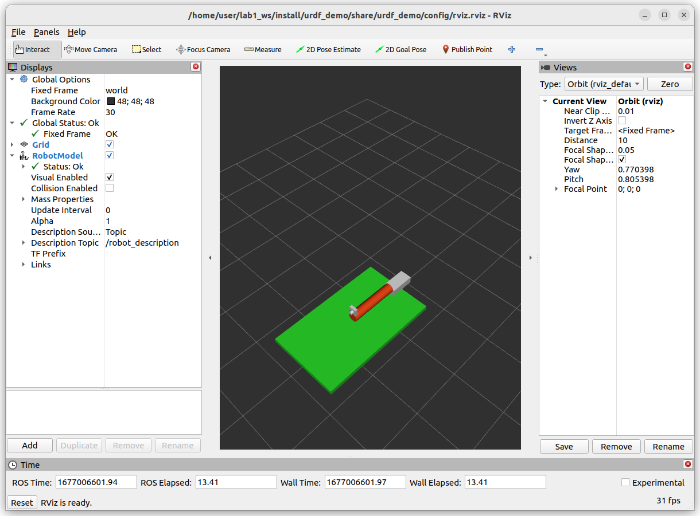

# Lab2

1. Switch to xacro
1. Add more links and joints
1. Using launch params
     1. change base link color between blue to red


### 


### change base color
```bash
ros2 launch urdf_demo lab2_v2.launch.py -s
Arguments (pass arguments as '<name>:=<value>'):

    'base_link_color':
        switch base link color between blue to  white
        (default: 'blue')


# run with argument
ros2 launch urdf_demo lab2_v2.launch.py base_link_color:=white
```
